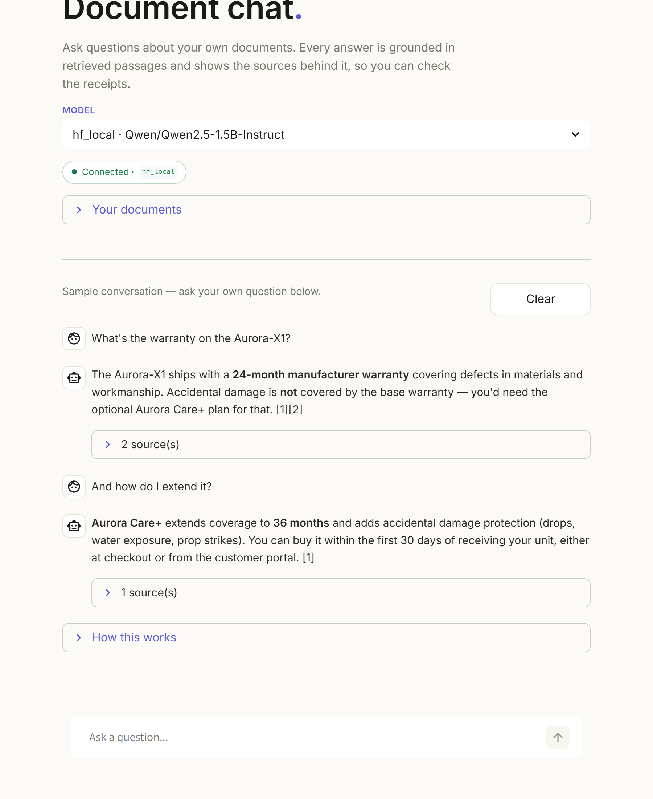

# Document chat

A small chatbot that answers questions about your own documents and shows the passages it pulled the answer from, so you can check the receipts.

<p>
  
  
  
  
  
</p>

<p align="center">
  
</p>

## What this is

You drop a few `.txt`, `.md`, or `.pdf` files into a folder, the app indexes them with sentence-transformers + FAISS, and then a small chat UI lets you ask questions in plain English. Every reply is written by a language model — but the model only ever sees passages retrieved from your documents, and the citations under each answer point straight back at the source chunk.

It's the difference between a search box and a chatbot: you can ask follow-up questions ("and how do I extend it?") and the bot remembers what "it" refers to.

## How it works

```
   You ask a question
          │
          ▼
   Retrieval ─── FAISS top-12 ─── cross-encoder rerank ─── top-5 passages
          │
          ▼
   Prompt build ── system prompt + last 6 turns + retrieved passages + question
          │
          ▼
   LLM streams the answer ── Groq · Claude · GPT · Ollama · local HF
          │
          ▼
   Answer + citations ── rendered token-by-token in the chat
```

The first backend with a key or runtime available wins. Switching is live from the dropdown in the main pane.

## Run it yourself

```bash
pip install -r requirements.txt

# Pick ONE backend
export GROQ_API_KEY=gsk_...
# or  ANTHROPIC_API_KEY, OPENAI_API_KEY, or install ollama / transformers

python -m src.ingest                    # build the FAISS index
streamlit run app/streamlit_app.py      # chat UI
```

A terminal REPL works too:

```bash
python -m src.rag                       # interactive multi-turn chat
python -m src.rag "What is the warranty on the X1?"
```

## Use it on your own documents

Drag `.txt`, `.md`, or `.pdf` files into the **Your documents** expander in the app and click **Build / rebuild index** — or drop them into `data/docs/` and run `python -m src.ingest`.

## Backends

| Backend | Setup | When to use |
|---|---|---|
| **Groq** | `pip install groq` + `GROQ_API_KEY` | Free tier, fastest, llama-3.3-70b default |
| **Anthropic** | `pip install anthropic` + `ANTHROPIC_API_KEY` | Claude reasoning quality |
| **OpenAI** | `pip install openai` + `OPENAI_API_KEY` | GPT-4o-mini default |
| **Ollama** | `pip install ollama` + `ollama serve` | Fully local, no rate limits |
| **HF local** | `pip install transformers torch` | Offline fallback on CPU |

## Project layout

```
doc-grounded-rag/
├── README.md
├── requirements.txt
├── src/
│   ├── config.py         # paths, model names, system prompt
│   ├── loaders.py        # txt / md / pdf
│   ├── ingest.py         # chunk → embed → FAISS
│   ├── retrieve.py       # FAISS top-k + cross-encoder rerank
│   ├── generate.py       # streaming multi-backend LLM
│   └── rag.py            # orchestration + CLI / REPL
├── app/
│   └── streamlit_app.py  # chat UI
└── data/
    └── docs/             # your documents go here
```

## What I'd add next

- Hybrid retrieval (BM25 + dense) for better keyword recall.
- Per-document namespaces so one index can serve multiple users.
- A small RAGAS-style eval harness for faithfulness and answer relevancy.
- A `search_web()` tool the bot can reach for when the documents don't cover the question.

---

Built by **Tadaishe Maumbe** · [@nanettetada](https://github.com/nanettetada)
